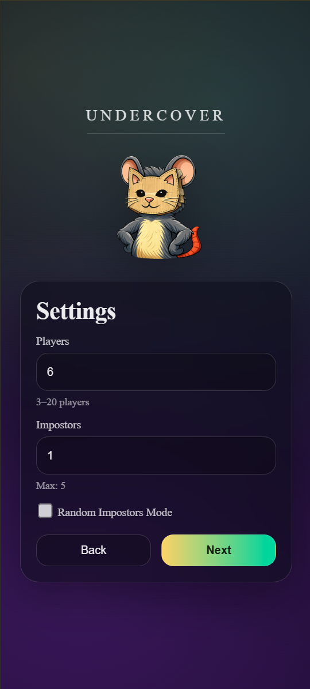
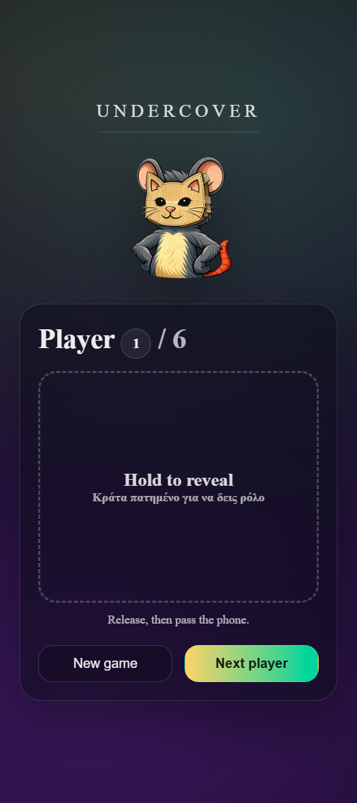
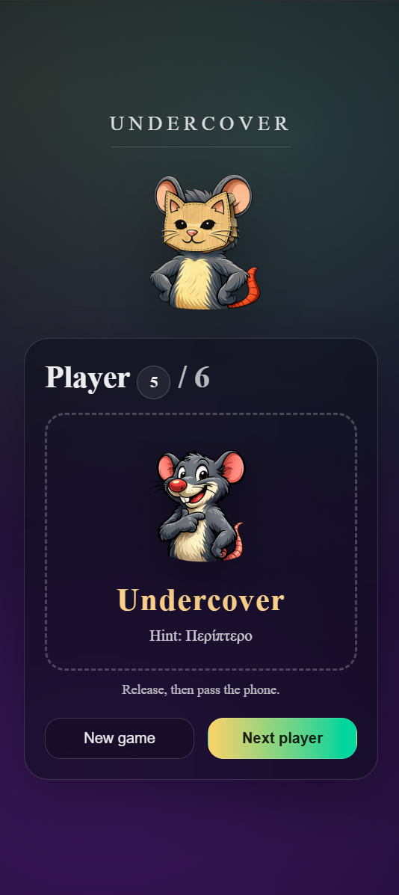

# Undercover

A mobile-first impostor party game built with React and Vite. One phone, a group of friends: everyone gets the secret word except the impostor, who only gets a hint and has to bluff their way through the discussion.

**Live demo:** [undercover-react-game.vercel.app](https://undercover-react-game.vercel.app/) · Best played on a phone.

<p align="center">
  
  
  
</p>

## How to play

1. Choose the number of players (3–20) and impostors, or turn on **Random Impostors Mode**, where anything from zero to half the players can be impostors. Yes, sometimes there is no impostor at all.
2. Pass the phone around. Each player **holds** the card to see their role, then releases it and passes the phone on.
3. Normal players see the secret word. The impostor sees only a hint.
4. The app picks a random player to start the discussion.
5. Talk, ask questions, and vote out the impostor before they guess the word.

## Features

- Random role assignment for any number of players and impostors
- Random Impostors Mode (0 to half the players), so nobody can be sure how many impostors there are
- Hold-to-reveal card, so roles stay hidden while the phone is passed around
- "Next player" stays disabled until the current player has seen their role
- Random starting player, with a re-roll option
- 60 Greek word/hint pairs, with no repeats until every word has been used
- Cats-and-mice avatar theme (the impostor is the rat)

## Tech stack

React 19 · Vite · JavaScript · CSS · ESLint · Deployed on Vercel

## Technical notes

- **Screen flow as a simple state machine.** The app moves through four screens (`WELCOME → SETTINGS → REVEAL → STARTER`) using one `screen` state value instead of a router.
- **Impostor selection** uses a `Set` of random player indices, which guarantees each impostor is a different player.
- **Avatars** are shuffled with a Fisher–Yates shuffle and repeated as needed to cover up to 20 players.
- **Hold-to-reveal** uses Pointer Events (`pointerdown`, `pointerup`, `pointercancel`, `pointerleave`), so the same code works with touch and mouse, and the role hides again if the finger slides off the card.
- **Word rotation** keeps a list of used words and starts a new cycle only when the whole pool has been played.

## Run locally

Requires Node.js 18+.

```bash
git clone https://github.com/MironFaryna/Undercover-react-game.git
cd Undercover-react-game
npm install
npm run dev
```

Other scripts: `npm run build` (production build), `npm run preview` (serve the build), `npm run lint`.

## Project structure

```
src/
├── App.jsx      # Screens, game logic and state
├── App.css      # Styles
├── word.js      # Greek word/hint pool
└── assets/      # Avatars and mascot
```

## Roadmap

- [ ] Finish the PWA setup (app icons) so the game can be installed on a phone
- [ ] English word pool and language switch
- [ ] Word categories
- [ ] Timer for the discussion round

## Author

**Miron Faryna** · [LinkedIn](https://www.linkedin.com/in/miron-faryna-385171339/) · [GitHub](https://github.com/MironFaryna)
